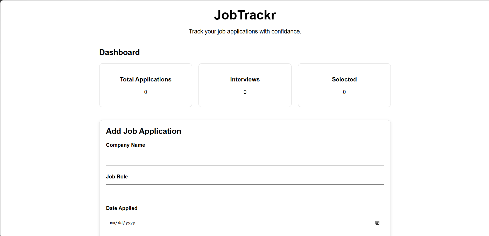

# JobTrackr
A beginner-friendly job application and interview tracker.

## Features 

- Add job applications
- Track company name and job role 
- Record application date
- Track application status
- Add notes and job posting links
- View total applications 
- Track interviews and selected applications
- Delete applications 
- Search applications by company name or job role 
- Case-insensitive search

## Technologies Used 

- HTML 
- CSS
- JavaScript 
- Git 
- GitHub
- Git Bash

## About the Project 

JobTrackr is a beginner-friendly web application designed to help users organize and track their job applications in one place.
Users can add application details such as the company name, job role, application date, status, notes, and job posting links. The dashboard also provides simple statistics for total applications, interviews ,and selected applications.
The project was built as a practical learning project to understand HTML, CSS, JavaScript, Git, and GitHub while creating a useful real-world application. 

## How to Run 

1. Clone the repository.
2. Open the project folder in VS Code.
3. Open `index.html` with Live Server.
4. The JobTrackr application will open in your browser.

## Future Improvements 

- Save applications using browser local storage
- Add application filtering by status
- Add sorting options
- Add a responsive design for mobile devices
- Add dark mode 
- Add charts and visual analytics 
- Deploy the project using GitHub Pages

## Screenshot

